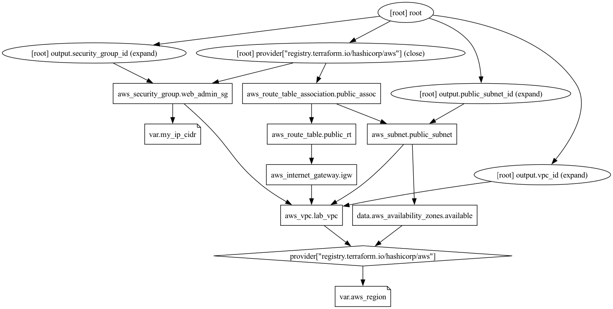

# AWS Security Group Lab (Terraform)

## What this lab builds
- VPC + public subnet + IGW + routing (foundation)
- Security group with:
  - inbound SSH (22) only from my public IP
  - inbound HTTPS (443) from anywhere
  - outbound all

## Why this matters
Demonstrates security fundamentals:
- inbound vs outbound
- least privilege access (SSH restricted)
- IaC repeatability and cleanup

## Run
terraform init
terraform plan
terraform apply

## Cleanup
terraform destroy

## Architecture Diagram

The infrastructure created by this Terraform lab:

